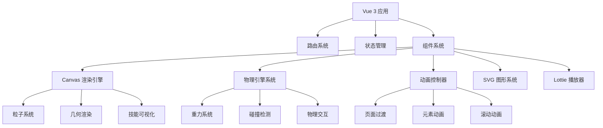

# 交互式游戏风格简历网站设计文档

## 概述

本设计文档详细描述了一个符合 awwwards 审美标准的交互式游戏风格简历网站的架构设计。网站将采用 Vue 3 + TypeScript + Vite 作为核心框架，结合 Canvas 2D 渲染、Matter.js 物理引擎、GSAP 动画库、SVG 图形和 Lottie 动画等技术，为徐思宏的简历创造沉浸式的游戏化展示体验。

## 架构设计

### 整体架构



### 技术栈选择

- **核心框架**: Vue 3 + Composition API + TypeScript
- **构建工具**: Vite + Rolldown
- **样式框架**: Tailwind CSS
- **2D 渲染**: HTML5 Canvas + OffscreenCanvas
- **物理引擎**: Matter.js
- **动画库**: GSAP + ScrollTrigger
- **矢量图形**: SVG + 自定义图标库
- **矢量动画**: Lottie + LottieFiles
- **状态管理**: Pinia
- **路由**: Vue Router 4

## 组件架构

### 核心组件设计

#### 1. 应用容器组件 (App.vue)

```typescript
interface AppState {
    isLoading: boolean;
    currentSection: string;
    theme: "light" | "dark";
    animationsEnabled: boolean;
}
```

#### 2. Canvas 渲染引擎 (CanvasEngine.vue)

```typescript
interface CanvasEngineProps {
    width: number;
    height: number;
    pixelRatio: number;
    enablePhysics: boolean;
}

interface CanvasEngineState {
    ctx: CanvasRenderingContext2D | null;
    animationId: number;
    particles: Particle[];
    shapes: Shape[];
}
```

#### 3. 物理系统组件 (PhysicsSystem.vue)

```typescript
interface PhysicsSystemProps {
    gravity: { x: number; y: number };
    enableCollision: boolean;
    bodies: PhysicsBody[];
}

interface PhysicsBody {
    id: string;
    type: "rectangle" | "circle" | "polygon";
    position: { x: number; y: number };
    velocity: { x: number; y: number };
    mass: number;
    restitution: number;
}
```

#### 4. 动画控制器 (AnimationController.vue)

```typescript
interface AnimationControllerProps {
    timeline: GSAPTimeline;
    triggers: ScrollTrigger[];
    autoPlay: boolean;
}

interface AnimationState {
    isPlaying: boolean;
    progress: number;
    duration: number;
}
```

### 页面组件设计

#### 1. 主页组件 (HomePage.vue)

- 游戏风格的欢迎界面
- 动态粒子背景
- 物理交互元素
- 个人头像和基本信息

#### 2. 技能页面 (SkillsPage.vue)

- 技能雷达图 (Canvas 渲染)
- 技术栈标签云 (物理交互)
- 编程语言进度条动画
- 工具和框架图标展示

#### 3. 经验页面 (ExperiencePage.vue)

- 时间轴设计
- 项目卡片翻转动画
- 技术架构图可视化
- 工作经历详情模态框

#### 4. 项目页面 (ProjectsPage.vue)

- 项目网格布局
- 悬停效果和动画
- 项目详情展开
- 技术栈标签

#### 5. 成就页面 (AchievementsPage.vue)

- 奖项展示动画
- 物理掉落效果
- 证书和徽章图标
- 成就统计图表

## 数据模型

### 个人信息模型

```typescript
interface PersonalInfo {
    name: string;
    age: number;
    location: string;
    email: string;
    phone: string;
    salary: string;
    avatar?: string;
    bio?: string;
}
```

### 技能模型

```typescript
interface Skill {
    id: string;
    name: string;
    category: "language" | "framework" | "tool" | "database";
    level: number; // 1-10
    icon: string;
    color: string;
    experience: number; // 年数
}

interface SkillCategory {
    name: string;
    skills: Skill[];
    color: string;
}
```

### 工作经验模型

```typescript
interface WorkExperience {
    id: string;
    company: string;
    position: string;
    startDate: string;
    endDate: string | null;
    description: string;
    projects: Project[];
    technologies: string[];
}

interface Project {
    id: string;
    name: string;
    description: string;
    technologies: string[];
    highlights: string[];
    architecture?: string;
    role: string;
}
```

### 成就模型

```typescript
interface Achievement {
    id: string;
    title: string;
    organization: string;
    date: string;
    level: "gold" | "silver" | "bronze" | "special";
    category: string;
    description?: string;
    icon: string;
}
```

## 交互设计

### 导航系统

- **游戏风格菜单**: 使用 SVG 图标和 GSAP 动画
- **页面切换**: 物理引擎驱动的过渡效果
- **面包屑导航**: 动态更新当前位置
- **快捷键支持**: 键盘导航和快捷操作

### 粒子系统

```typescript
interface Particle {
    x: number;
    y: number;
    vx: number;
    vy: number;
    size: number;
    color: string;
    life: number;
    maxLife: number;
    type: "circle" | "square" | "triangle";
}

class ParticleSystem {
    particles: Particle[];
    maxParticles: number;

    update(deltaTime: number): void;
    render(ctx: CanvasRenderingContext2D): void;
    addParticle(config: Partial<Particle>): void;
    removeDeadParticles(): void;
}
```

### 物理交互

- **重力效果**: 页面元素受重力影响
- **碰撞检测**: 元素间的物理碰撞
- **鼠标交互**: 鼠标作为物理力场
- **边界约束**: 防止元素飞出屏幕

### 动画系统

```typescript
interface AnimationConfig {
    duration: number;
    ease: string;
    delay: number;
    stagger?: number;
    repeat?: number;
    yoyo?: boolean;
}

class AnimationManager {
    timelines: Map<string, GSAPTimeline>;

    createTimeline(id: string): GSAPTimeline;
    playAnimation(id: string, config: AnimationConfig): void;
    pauseAnimation(id: string): void;
    resetAnimation(id: string): void;
}
```

## 视觉设计

### 色彩方案

```css
:root {
    /* 主色调 - 游戏风格蓝色 */
    --primary-50: #eff6ff;
    --primary-500: #3b82f6;
    --primary-900: #1e3a8a;

    /* 辅助色 - 能量绿色 */
    --accent-400: #34d399;
    --accent-600: #059669;

    /* 警告色 - 橙色 */
    --warning-400: #fbbf24;
    --warning-600: #d97706;

    /* 背景色 */
    --bg-primary: #0f172a;
    --bg-secondary: #1e293b;
    --bg-tertiary: #334155;

    /* 文字色 */
    --text-primary: #f8fafc;
    --text-secondary: #cbd5e1;
    --text-muted: #64748b;
}
```

### 字体系统

```css
.font-display {
    font-family: "Orbitron", "Inter", system-ui, sans-serif;
    font-weight: 700;
}

.font-body {
    font-family: "Inter", system-ui, sans-serif;
    font-weight: 400;
}

.font-code {
    font-family: "JetBrains Mono", "Fira Code", monospace;
}
```

### 动画缓动函数

```typescript
const EASING = {
    elastic: "elastic.out(1, 0.3)",
    bounce: "bounce.out",
    back: "back.out(1.7)",
    power: "power2.out",
    expo: "expo.out",
    circ: "circ.out",
};
```

## 性能优化策略

### Canvas 优化

- **离屏渲染**: 复杂图形预渲染到离屏 Canvas
- **脏矩形更新**: 只重绘变化区域
- **对象池**: 复用粒子和图形对象
- **LOD 系统**: 根据距离调整渲染质量

### 物理引擎优化

- **空间分割**: 使用四叉树优化碰撞检测
- **休眠机制**: 静止物体进入休眠状态
- **简化碰撞体**: 使用简单几何体代替复杂形状
- **帧率控制**: 物理更新与渲染分离

### 动画优化

- **硬件加速**: 优先使用 transform 和 opacity
- **批量更新**: 合并 DOM 操作
- **防抖节流**: 限制高频事件处理
- **内存管理**: 及时清理动画实例

### 资源优化

- **懒加载**: 按需加载组件和资源
- **预加载**: 关键资源提前加载
- **压缩优化**: 图片和动画文件压缩
- **CDN 加速**: 静态资源 CDN 分发

## 响应式设计

### 断点系统

```typescript
const BREAKPOINTS = {
    sm: "640px",
    md: "768px",
    lg: "1024px",
    xl: "1280px",
    "2xl": "1536px",
};
```

### 适配策略

- **流式布局**: 使用 Flexbox 和 Grid
- **相对单位**: rem、em、vw、vh
- **媒体查询**: 响应式样式调整
- **触摸优化**: 移动端交互优化

## 无障碍设计

### 键盘导航

- **Tab 顺序**: 逻辑的焦点顺序
- **快捷键**: 常用操作快捷键
- **焦点指示**: 清晰的焦点样式
- **跳转链接**: 快速跳转到主要内容

### 屏幕阅读器支持

- **语义化标签**: 正确的 HTML 结构
- **ARIA 属性**: 增强语义信息
- **替代文本**: 图片和图标描述
- **状态通知**: 动态内容变化通知

### 视觉辅助

- **高对比度**: 足够的颜色对比度
- **字体大小**: 可调节的字体大小
- **动画控制**: 可禁用动画选项
- **色彩辅助**: 不依赖颜色传达信息

## 错误处理

### 错误边界

```typescript
interface ErrorBoundaryState {
    hasError: boolean;
    error: Error | null;
    errorInfo: string | null;
}

class ErrorBoundary extends Vue.Component {
    // 错误捕获和处理逻辑
}
```

### 降级策略

- **Canvas 降级**: 不支持时使用 CSS 动画
- **物理引擎降级**: 简化为 CSS 过渡
- **动画降级**: 减少动画复杂度
- **功能降级**: 核心功能优先保证

## 测试策略

### 单元测试

- **组件测试**: Vue Test Utils
- **工具函数测试**: Vitest
- **动画测试**: GSAP 动画状态验证
- **物理引擎测试**: Matter.js 行为测试

### 集成测试

- **页面交互测试**: 用户操作流程
- **性能测试**: 动画帧率和内存使用
- **兼容性测试**: 不同浏览器和设备
- **无障碍测试**: 键盘导航和屏幕阅读器

### 视觉回归测试

- **截图对比**: 自动化视觉测试
- **动画测试**: 关键帧截图对比
- **响应式测试**: 不同屏幕尺寸测试
- **主题测试**: 明暗主题对比
